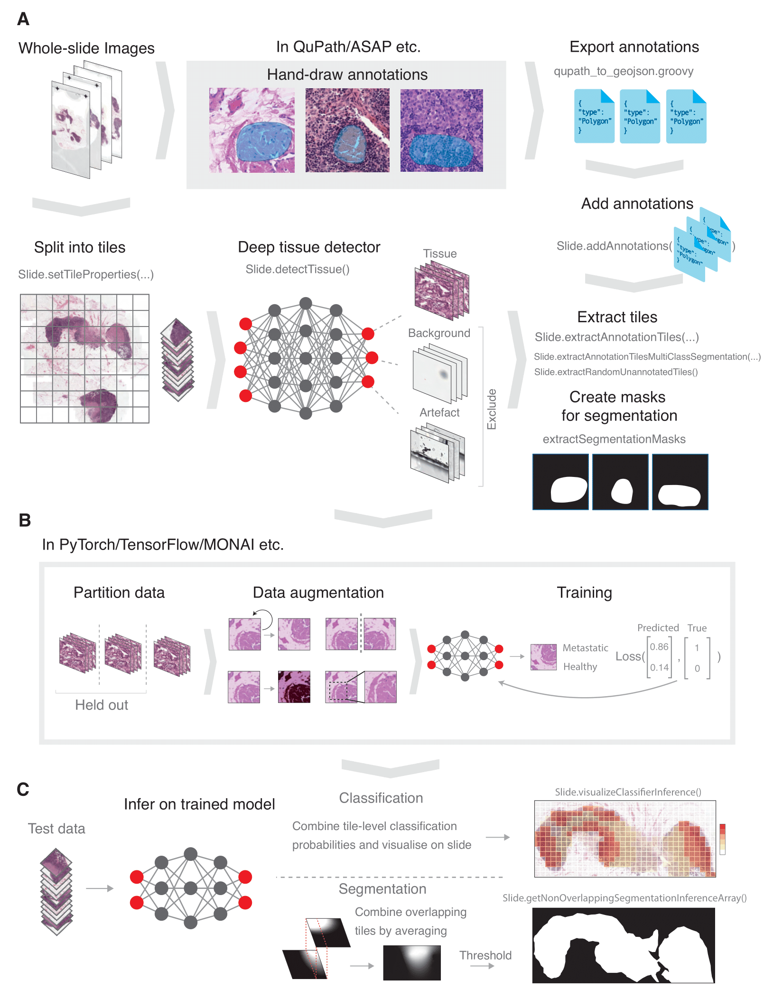

.. slidl documentation master file, created by
   sphinx-quickstart on Tue Feb  8 20:52:24 2022.
   You can adapt this file completely to your liking, but it should at least
   contain the root `toctree` directive.

Welcome to SliDL's documentation!
=================================

``SliDL`` is a Python library of pre- and post-processing tools for applying deep
learning to whole-slide images (WSIs), including deep tissue detection, artefact
and background filtering, digital annotation parsing, tile extraction, model inference,
model evaluation and more. It supports both classification and segmentation tasks at the
tile level.

.. toctree::
  :maxdepth: 2
  :caption: Installation and tutorial

  installation
  tutorial

.. toctree::
  :maxdepth: 2
  :caption: API reference

  slidl

Indices and tables
==================

* :ref:`genindex`
* :ref:`search`
