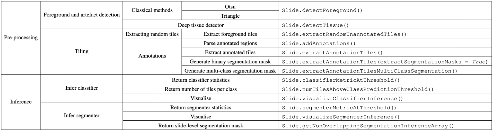

The Slide class
===============

The main class of ``SliDL`` for performing operations on a whole-slide image.
Here is a brief summary of some of the crucial functions of ``Slide`` and when to use them:

.. autoapiclass:: slidl.slide.Slide
